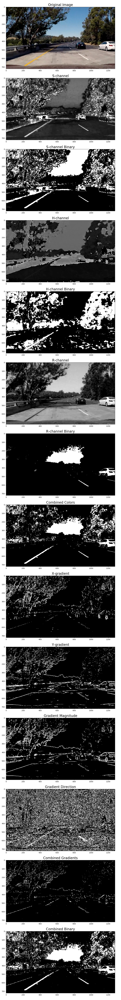

# Advanced Lane Finding Project

The goals / steps of this project are the following:

* Compute the camera calibration matrix and distortion coefficients given a set of chessboard images.
* Apply a distortion correction to raw images.
* Use color transforms, gradients, etc., to create a thresholded binary image.
* Apply a perspective transform to rectify binary image ("birds-eye view").
* Detect lane pixels and fit to find the lane boundary.
* Determine the curvature of the lane and vehicle position with respect to center.
* Warp the detected lane boundaries back onto the original image.
* Output visual display of the lane boundaries and numerical estimation of lane curvature and vehicle position.

[//]: # (Image References)

[image1]: ./examples/undistorted_calibration1.png "Undistorted Chessboard"
[image2]: ./examples/undistorted_test4.png "Undistorted Road Image"
[image3]: ./examples/thresholded_test5.png "Thresholding"
[image4]: ./examples/warped_straight_lines1.png "Perspective Transform"
[image5]: ./examples/color_fit_lines.jpg "Fit Visual"
[image6]: ./examples/lane_detected_test5.png "Lane Detection and Overlay"

## [Rubric](https://review.udacity.com/#!/rubrics/571/view) Points
### Here I will consider the rubric points individually and describe how I addressed each point in my implementation.

---
### Writeup / README

####1. Provide a Writeup / README that includes all the rubric points and how you addressed each one.  You can submit your writeup as markdown or pdf.  

You're reading it!

###Camera Calibration

####1. Briefly state how you computed the camera matrix and distortion coefficients. Provide an example of a distortion corrected calibration image.

The camera calibration code is located in file `lens_correction.py`, class `TLensCorrector`. An object of the class is constructed with the calibration directory parameter. The calibration directory is expected to contain images of a 9x6 chessboard. The object constructor generates or loads (if exists) the lens calibarion data.

Generating the lens calibration data starts by preparing "object points", which will be the (x, y, z) coordinates of the chessboard corners in the world. I am assuming the chessboard is fixed on the (x, y) plane at z=0, such that the object points are the same for each calibration image. Thus, `singleObjPoints` is just a replicated array of coordinates, and `objPoints` will be appended with a copy of it every time all chessboard corners are successfully detected in a test image.  `imgPoints` will be appended with the (x, y) pixel position of each of the corners in the image plane with each successful chessboard detection.

Then the output `objPoints` and `imgPoints` are used to compute the camera calibration and distortion coefficients using the `cv2.calibrateCamera()` function. Public method `GetCalibrationData::Undistort()` implements the distortion correction using the `cv2.undistort()` function. See the example of undistorting a chessboard image: 

![alt text][image1]

###Pipeline (single images)

A test pipeline code can be found in `test.py`, the real pipeline code is located in `main.py`.

####1. Provide an example of a distortion-corrected image.

The following picture provides side-by-side comparison of a distorted and an undistorted images:
![alt text][image2]
It's generated by running `test.py lens_correction <in_img> <out_img>`.

####2. Describe how (and identify where in your code) you used color transforms, gradients or other methods to create a thresholded binary image.  Provide an example of a binary image result.

A combination of color and gradient thresholds is used to generate a binary image. The code is located in file `binary_thresholding.py`, function `GetThresholdedBinary()`. The function implements a thresholding pipeline, illustrated by the plot below:
* **S-channel**: extracted from the HLS-colorspace of the original image
* **S-channel Binary**: obtained by applying a threshold to the S-channel image
* **H-channel**: extracted from the HLS-colorspace of the original image
* **H-channel Binary**: obtained by applying a threshold to the H-channel image
* **R-channel**: extracted from the original BGR-colorspace
* **R-channel Binary**: obtained by applying a threshold to the B-channel image
* **Combined Colors**: S-channel tolerates shadows and it is good in capturing yellow lines, so it's used in conjunction with H-channel, which captures same color regions. R-channel captures white lines only and forms a union with S and H.
* **X-gradient**: captures vertical line edges
* **Y-gradient**: captures horizontal line edges
* **Gradient Magnitude**: captures contrast line edges
* **Gradient Direction**: noisy, but helpful in conjunction with Gradient Magnitude for detecting same-direction edges
* **Combined Gradients**: a union of two conjunctions: X-gradient with Y-gradient, and Gradient Magnitude with Gradient Direction
* **Combined Binary**: a union of combined colors and combined gradients, takes the best of two worlds: reliable near-view color detection, and far-view gradient detection

tolerates shadows on the lane lines, so we should use it in conjunction with H-channel, which captures same color regions. 

    

####3. Describe how (and identify where in your code) you performed a perspective transform and provide an example of a transformed image.

Perspective transformation is implemented in file `perspective_transform.py`, class `TPerspectiveTransformer`. The class constructor uses function `cv2.getPerspectiveTransform()` to compute the transformation matrix `M` as well as inverse matrix `Minv`, using manually picked source and destination points:

| Corner       | Source        | Destination | 
|:------------:|:-------------:|:-----------:| 
| Left-Bottom  | 193, 719      | 320, 719    | 
| Left-Top     | 595, 449      | 320, 0      |
| Right-Top    | 685, 449      | 960, 0      |
| Right-Bottom | 1122, 719     | 960, 719    |

The utility class `TPerspectiveTransformer` exposes two public methods - `Warp()` and `Unwarp()` - using `cv2.warpPerspective()` function with matrix `M` and `Minv` respectively.

The perspective transform works as expected, the warped image of straight lines contains truly straight parallel lines:

![alt text][image4]

####4. Describe how (and identify where in your code) you identified lane-line pixels and fit their positions with a polynomial?

The lane detection and tracking code is located in file `lane_tracking.py`, class `TLaneTracker`. Actually the class is pretty shallow, only instantiating two objects of class `TLine`, which do the heavy-lifting. The public method `TLaneTracker::ProcessLaneImage()` splits a binary image of the lane into two parts (left and right) and passes them to the corresponding `TLine` instances. `TLine` implements two private methods of detecting lane lines, described in lectures: `TLine::ExtractNewPoints()` for window-based initial or recovery line detection, and `TLine::ExtractUpdatedPoints()` for deriving polynomial line coefficients with updated line points. In both cases the line points are fit with a 2nd order polynomial, illustrated on this picture:

![alt text][image5]

An object of class `TLine` maintains a history of 7 most recent samples using private method `UpdateHistoryWithNewPoints()`. Public method `ProcessLineImage()` uses either way for computing polynomial coefficients: `ExtractNewPoints()` or `ExtractUpdatedPoints()`. In case of updating with the later method, a sanity check is performed against the updated coefficients whether they are off limits, which are manually picked as doubled maximum observed coefficients for [project video](./project_video.mp4) `(6e-4, 4e-1, 1e+2)`. If the updated coefficients are off-limits, they are discarded, and the history is truncated by the oldest entry. Once the history list is empty, the recovery line detection method `ExtractNewPoints()` is used for deriving the new polynomial coefficients.

####5. Describe how (and identify where in your code) you calculated the radius of curvature of the lane and the position of the vehicle with respect to center.

The radius of curvature and course deviation are computed in the same file `lane_tracking.py`. Method `TLaneLines::TLine::UpdateHistoryWithNewPoints()` calculates the curvature radius in meters and stores it in the curvature history list. The history is used by method `TLine::ProcessLineImage()` for calculating the average curvature radius over up to 7 recent samples, as well as the base line X-position, which are returned to the object of class `TLaneTracker`. Then method `TLaneTracker::ProcessLaneImage()` calculates the mean curvature radius for two lane lines, and the course deviation assuming that the lane width is 3.7 meters. Both values are returned to the user for further adding to the video overlay.

####6. Provide an example image of your result plotted back down onto the road such that the lane area is identified clearly.

The real overlay code is implemented in file `main.py`, function `ProcessImage()` which is used for processing MoviePy images. However there's also a unit testing code for the overlay functionality implemented in file `test.py`, called with `test.py lane_tracking <in_img> <out_img>`:

![alt text][image6]

---

###Pipeline (video)

####1. Provide a link to your final video output.  Your pipeline should perform reasonably well on the entire project video (wobbly lines are ok but no catastrophic failures that would cause the car to drive off the road!).

Here's a [link to my video result](https://youtu.be/464FM1oQzE0)

---

###Discussion

####1. Briefly discuss any problems / issues you faced in your implementation of this project.  Where will your pipeline likely fail?  What could you do to make it more robust?

The approach discussed in the project lectures is pretty simple, straightforward, and reliable, when applied to the project video. I haven't faced any issues implementing it. The project video is pretty forgiving when misusing some techniques, like binary thresholding with gradient magnitude and direction. The implementation successful for the project video, but it fails as-is for the challenge videos. The first challenge video contains very sharp gradients in the bottom of the jersey wall, between new and old concrete, and at the edge of the wall shadow. These gradients are much higher than for the lane lines, which look old, bleak and woren out. The gradient thresholding used for the project video has to be revised to work well with the first challenge video. I think that the color-only line detection is way more reliable with the first challenge video, but it reduces performance with the basic project video. The second challenge video is even harder since it includes steep hills and sharp turns. A static perspective transform is no longer working in case of changing level of horizon. I think this problem can be solved by using a tilt sensor, since there's no other way to figure out the level of horizon. Another problems of the second challenge video are severe flares and one of the lane lines disappearing due to sharp turns. Flares could probably be worked around by processing the raw camera pictures (rather than JPEG) to cure the overexposure, while disappearing lane lines could be assumed to exist beyond the Field-of-View at extreme steering angles.
